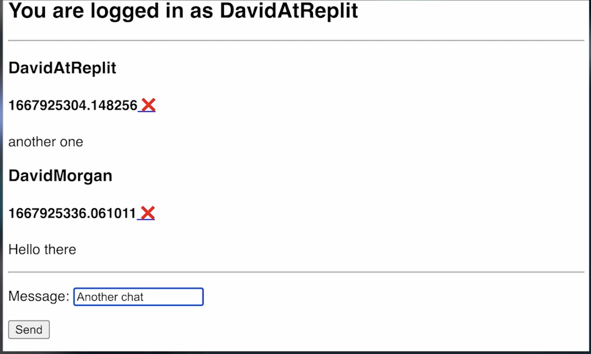

# 👉 Day 89 Challenge

Today's challenge is to build a community chat app.

1. Create a login screen. You can use the simple or complex version of Replit authentication. It's up to you.
2. Once authenticated, users will be directed to a chat room where:
    1. They can see the last five messages on screen.
    2. They can add a new message.
3. Each message should be displayed with the username and profile pic of the poster.
4. Allow **only your** username to be an admin. This should:
    1. Give you and you alone access to an 'admin' button.
    2. Give you the power to delete any message from the board with a delete button.

5. Don't worry about auto refreshing the chat just yet. We're not getting into Javascript in this 100 days.

Example:

 
 💡 Hints 

- Use replit db to store messages. 
- Use a timestamp as the key for each message.
- Make sure that the user's ID/username etc. is in the dictionary as well the message.

